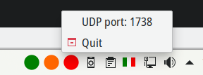

quoll
-----

quoll is a generic indicator for the system tray that displays SVG and PNG
icons. It currently support only Linux.
It was inspired by [AnyBar](https://github.com/tonsky/AnyBar) and basically it's
a clone with small differences.

### Screenshots



### Installation

quoll depends on `libappindicator3` so in order to compile it you have to
install it first.
On Debian (and derivatives):
```
sudo apt install libappindicator3-dev
```

Then simply do:

```
cargo install quoll
```

Distribution of resources is not supported yet using cargo, so to get the base
icons (as the ones included in AnyBar, but in SVG format) just download them
and put in the directory where quoll will search for them:

```
mkdir -p $(quoll home) && curl -s https://github.com/eriol/quoll/releases/download/0.1.0/base_resources.tar.gz | tar xzf - -C $(quoll home)
```

### Usage

quoll is controlled via UDP (default port is 1738). To start it use the `serve`
subcommand:

```
quoll serve
```

To send a message to change the icon use the `send` subcommand, for example:

```
quoll send green
```

The message is simply the icon name, without the extension.

To list the icons currently available, and so the corresponding messages that
we can send:

```
ls $(quoll home)
```

SVG icons will always precede PNG ones, so having both `my_icon.svg` and
`my_icon.png` in `quoll home` directory, when we send `quoll send my_icon` the
SVG one will be displayed.

The special message `quit` makes quoll to terminate.

UDP port can be specified with the `-p` flag and works for both `serve` and
`send` subcommand:
```
quoll -p 1234 serve
```

```
quoll -p 1234 send red
```

For full usage instructions use:

```
quoll help
```

### License

quoll is licensed under GPL-3.
